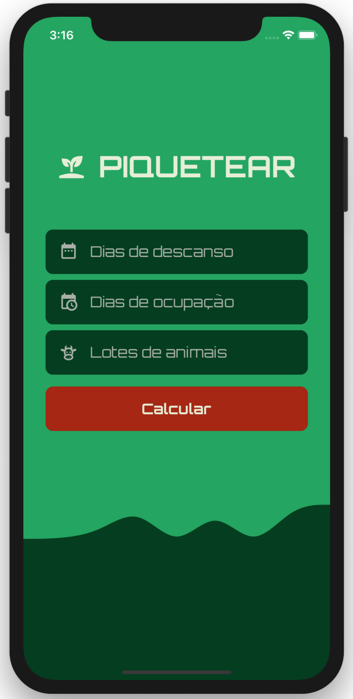
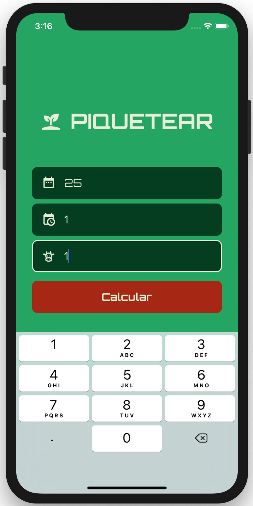
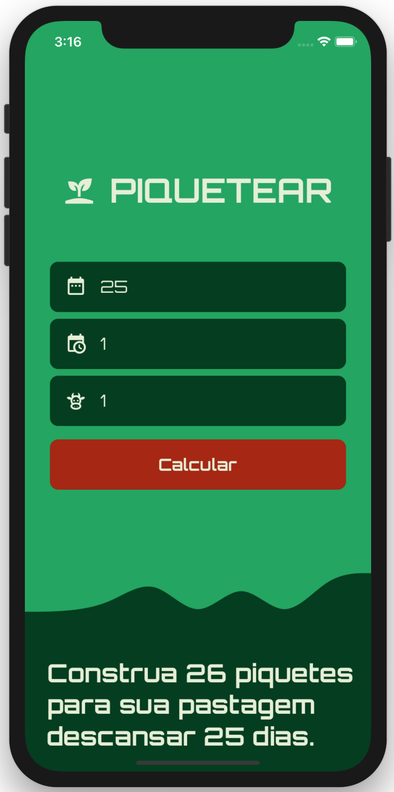

<!--
*** Thanks for checking out this README Template. If you have a suggestion that would
*** make this better, please fork the repo and create a pull request or simply open
*** an issue with the tag "enhancement".
*** Thanks again! Now go create something AMAZING! :D
***
***
***
*** To avoid retyping too much info. Do a search and replace for the following:
*** github_username, repo_name, twitter_handle, email
-->


<!-- PROJECT SHIELDS -->
<!--
*** I'm using markdown "reference style" links for readability.
*** Reference links are enclosed in brackets [ ] instead of parentheses ( ).
*** See the bottom of this document for the declaration of the reference variables
*** for contributors-url, forks-url, etc. This is an optional, concise syntax you may use.
*** https://www.markdownguide.org/basic-syntax/#reference-style-links
-->
[![Contributors][contributors-shield]][contributors-url]
[![Forks][forks-shield]][forks-url]
[![Stargazers][stars-shield]][stars-url]
[![Issues][issues-shield]][issues-url]
[![MIT License][license-shield]][license-url]
[![LinkedIn][linkedin-shield]][linkedin-url]


<!-- PROJECT LOGO -->
<br />
<p align="center">
  <a href="https://github.com/senott/Piquetear">
    
  </a>

  <h3 align="center">PIQUETEAR</h3>

  <p align="center">
    Mobile application, for iOS and Android, to calculate the number of paddocks in a rational rotational grazing system.
    <br />
    <a href="https://github.com/senott/Piquetear"><strong>Explore the docs »</strong></a>
    <br />
    <br />
    <a href="https://github.com/senott/Piquetear">View Demo</a>
    ·
    <a href="https://github.com/senott/Piquetear/issues">Report Bug</a>
    ·
    <a href="https://github.com/senott/Piquetear/issues">Request Feature</a>
  </p>
</p>


<!-- TABLE OF CONTENTS -->
## Table of Contents

* [About the Project](#about-the-project)
  * [Built With](#built-with)
* [Getting Started](#getting-started)
  * [Prerequisites](#prerequisites)
  * [Installation](#installation)
* [Usage](#usage)
* [Roadmap](#roadmap)
* [Contributing](#contributing)
* [License](#license)
* [Contact](#contact)
* [Acknowledgements](#acknowledgements)


<!-- ABOUT THE PROJECT -->
## About The Project

### Android screenshots:


### iOS screenshots:


Here's a blank template to get started:
**To avoid retyping too much info. Do a search and replace with your text editor for the following:**
`github_username`, `repo_name`, `twitter_handle`, `email`


### Built With

* [React Native]()
* [Typescript]()


<!-- GETTING STARTED -->
## Getting Started

To get a local copy up and running follow these simple steps.

### Prerequisites

* Yarn
```sh
npm install -g yarn
```

### Installation

1. Clone the repo
```sh
git clone https://github.com/senott/Piquetear.git
```
2. Install Yarn packages
```sh
yarn
```
3. If you're planning to run this project on a Mac, you also need to run the following comands in the project root folder:
```sh
cd ios
pod install
```

<!-- USAGE EXAMPLES -->
## Usage

If you have Android Studio installed on your machine, you can run this project in an Android emulator with the following command:
```sh
yarn android
```

If you have Xcode installed on your machine, you can run the project in an iOS emulator with the command:
```sh
yarn ios
```


<!-- ROADMAP -->
## Roadmap

See the [open issues](https://github.com/senott/Piquetear/issues) for a list of proposed features (and known issues).


<!-- CONTRIBUTING -->
## Contributing

Contributions are what make the open source community such an amazing place to be learn, inspire, and create. Any contributions you make are **greatly appreciated**.

1. Fork the Project
2. Create your Feature Branch (`git checkout -b feature/AmazingFeature`)
3. Commit your Changes (`git commit -m 'Add some AmazingFeature'`)
4. Push to the Branch (`git push origin feature/AmazingFeature`)
5. Open a Pull Request


<!-- LICENSE -->
## License

Distributed under the MIT License. See `LICENSE` for more information.


<!-- CONTACT -->
## Contact

Diego de A. Senott - [@senott](https://twitter.com/senott) - senott@yahoo.com

Project Link: [https://github.com/senott/Piquetear](https://github.com/senott/Piquetear)


<!-- ACKNOWLEDGEMENTS -->
## Acknowledgements

* []()
* []()
* []()


<!-- MARKDOWN LINKS & IMAGES -->
<!-- https://www.markdownguide.org/basic-syntax/#reference-style-links -->
[contributors-shield]: https://img.shields.io/github/contributors/senott/repo.svg?style=flat-square
[contributors-url]: https://github.com/senott/repo/graphs/contributors
[forks-shield]: https://img.shields.io/github/forks/senott/repo.svg?style=flat-square
[forks-url]: https://github.com/senott/repo/network/members
[stars-shield]: https://img.shields.io/github/stars/senott/repo.svg?style=flat-square
[stars-url]: https://github.com/senott/repo/stargazers
[issues-shield]: https://img.shields.io/github/issues/senott/repo.svg?style=flat-square
[issues-url]: https://github.com/senott/repo/issues
[license-shield]: https://img.shields.io/github/license/senott/repo.svg?style=flat-square
[license-url]: https://github.com/senott/repo/blob/master/LICENSE.txt
[linkedin-shield]: https://img.shields.io/badge/-LinkedIn-black.svg?style=flat-square&logo=linkedin&colorB=555
[linkedin-url]: https://linkedin.com/in/senott
